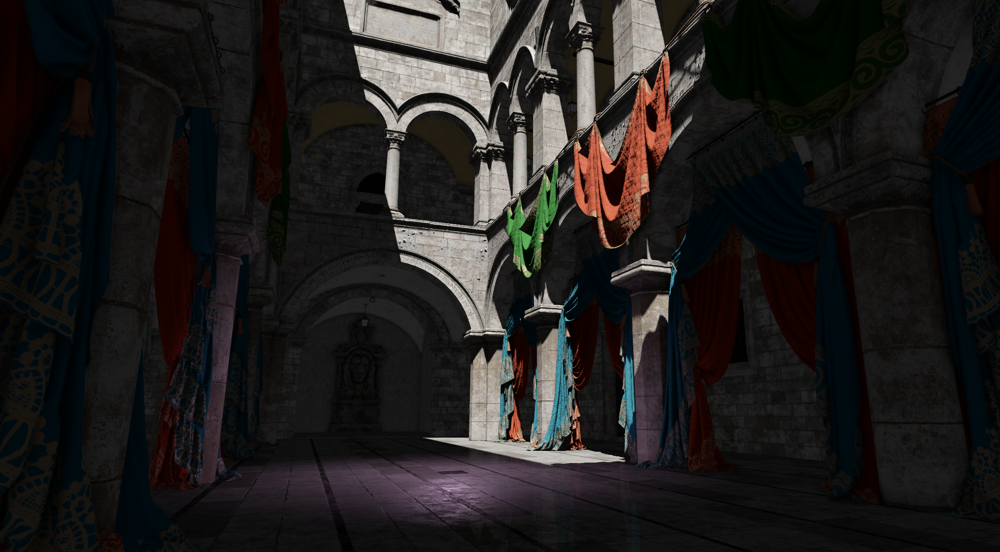
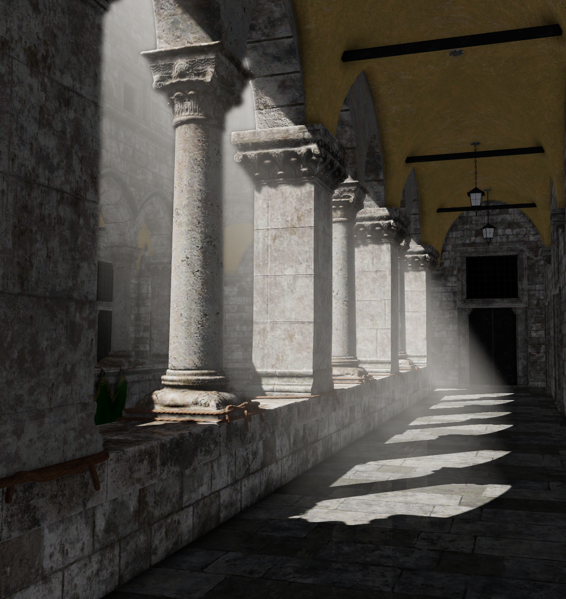

# Nyx GPU Playground

A real-time Vulkan playground written in C++23, built on top of [Daxa](https://github.com/Ipotrick/Daxa).




---

## Building

### Prerequisites

- CMake 3.21 or higher
- A Vulkan-capable GPU
- The Vulkan SDK installed and on your environment variables
- A compatible C++23 compiler (see presets below)

All other dependenciesare fetched automatically via CMake `FetchContent`.

### Configure & Build

The project ships with `CMakePresets.json` that covers four toolchain + OS combinations. Each preset has `Debug`, `RelWithDebInfo`, and `Release` build configurations.

| Configure Preset            | Toolchain                           |
| --------------------------- | ----------------------------------- |
| `cl-x86_64-windows-msvc`    | MSVC (`cl.exe`), Windows x86-64     |
| `clang-x86_64-windows-msvc` | Clang with MSVC ABI, Windows x86-64 |
| `gcc-x86_64-linux-gnu`      | GCC, Linux x86-64                   |
| `clang-x86_64-linux-gnu`    | Clang, Linux x86-64                 |

#### Example — MSVC (`cl.exe`) on Windows

```bat
# Configure
cmake --preset cl-x86_64-windows-msvc
# Build (Release)
cmake --build --preset cl-x86_64-windows-msvc-release
```

The binary is placed in `build/<preset-name>/Release/Nyx.exe`.

---

## Running

```
Nyx [--scene <name>]
```

| Argument  | Values            | Default | Description                    |
| --------- | ----------------- | ------- | ------------------------------ |
| `--scene` | `intel`, `crytek` | `intel` | Which scene to load at startup |

**Examples:**

```sh
# Load the Intel Sponza scene (default)
./Nyx --scene intel
# Load the Crytek Sponza scene
./Nyx --scene crytek
```

Scene assets are fetched automatically via CMake `FetchContent` from a [dedicated repository](https://github.com/lucas-stallknecht/dushha-assets).

### Camera Controls

| Input                     | Action                             |
| ------------------------- | ---------------------------------- |
| `W / A / S / D`           | Move forward / left / back / right |
| `Space`                   | Move up                            |
| `Left Ctrl`               | Move down                          |
| Right mouse mutton + Drag | Look around                        |

All camera parameters (FOV, move speed, look sensitivity) can be tuned in the **View & Debug** ImGui panel at runtime.

---

## Techniques

- Basic glTF loading and asset management
- CPU frustum culling
- Forward rendering with normal mapping, PBR, and transparency
- Directional shadow mapping with PCF
- MSAA
- **SSAO**: hemisphere kernel with noise rotation, followed by a blur pass
- **SSR**: screen-space ray-marching with a Fresnel/roughness mask
- **Bloom**: bright-parts extraction + separable Gaussian blur
- **Volumetric Lighting**: ray-marched directional light scattering
- HDR tonemapping
- **Debug Views**: albedo, normals, AO, shadow mask, AABB wireframes

---

## Roadmap

- GPU-driven rendering
- Overdraw visualization
- Replace screen-space techniques by hardware ray traced alternatives
- Global illumination (voxel or ray traced)
- Async compute experiments

---

## Dependencies

| Library                                                      | Purpose                                     |
| ------------------------------------------------------------ | ------------------------------------------- |
| [Daxa](https://github.com/Ipotrick/Daxa)                     | Vulkan bindless and frame graph abstraction |
| [GLFW](https://github.com/glfw/glfw)                         | Window and input                            |
| [GLM](https://github.com/g-truc/glm)                         | Math                                        |
| [fastgltf](https://github.com/spnda/fastgltf)                | glTF 2.0 scene loading                      |
| [KTX-Software](https://github.com/KhronosGroup/KTX-Software) | KTX/KTX2 texture loading                    |
| [Dear ImGui](https://github.com/ocornut/imgui)               | Runtime UI panels                           |
